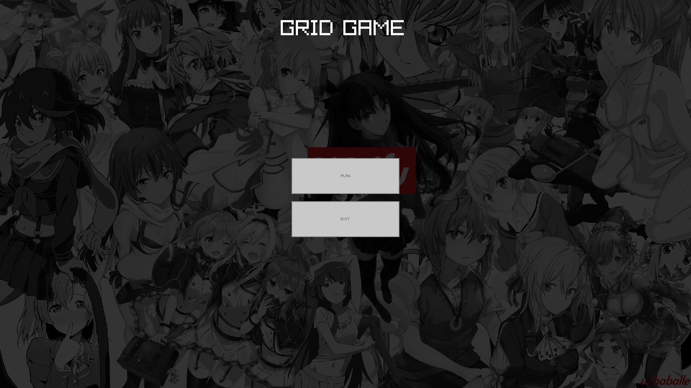
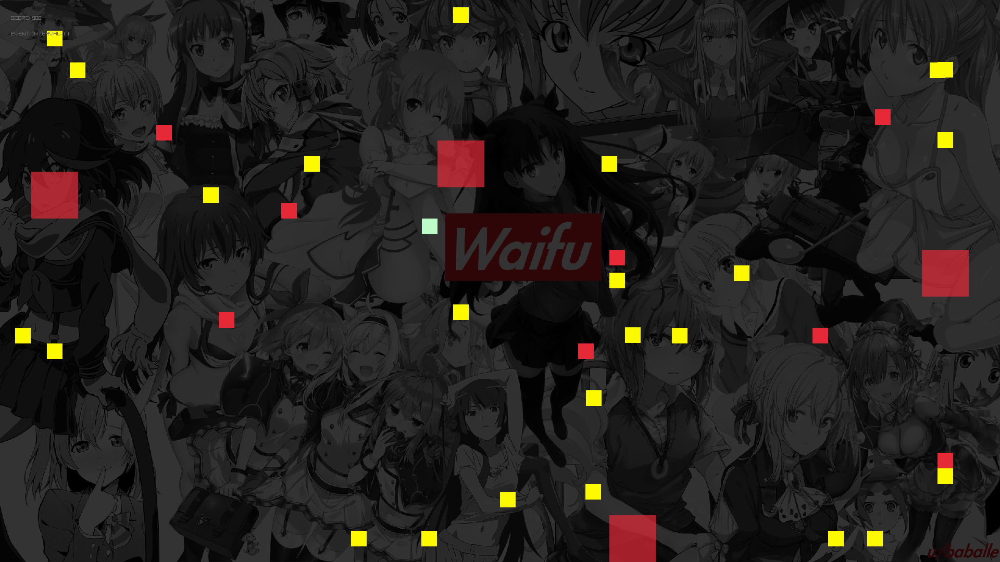

# 🎮 GridGame - Minimalistic Survival Game in C with Raylib

GridGame is a simple survival game written in C using the Raylib library (https://www.raylib.com/).  
The objective is straightforward: survive for as long as possible. The player cannot attack; they can only move around to avoid hazards. As the game progresses, the score increases and the interval between challenges decreases, making survival increasingly difficult.

Currently, GridGame is a prototype, but future plans include:  
- Cross-platform multiplayer (Windows, Linux, other Unix systems)  
- Multiple characters and abilities  
- Additional game options like sound, music, and visual settings  
- Fully configurable arena, graphics, and audio through a settings system  

For now, configuration is done via settings.txt and replacing .png files.

---

# 🔨 Compilation & Running

To play GridGame, you need to compile it. On Linux, follow these steps:

Prerequisites:  
- git  
- gcc  
- raylib or cmake/make

**Step 1: Download and build Raylib (if not installed)**
```bash
git clone https://github.com/raysan5/raylib.git  
cd raylib  
mkdir build  
cd build  
cmake ..  
make  
sudo make install
```

**Step 2: Clone GridGame repository** 
```bash
git clone https://github.com/zerfithel/gridgame.git  
cd gridgame
```

**Step 3: Compile and install the game**  
```bash
make
sudo make install
```

**After compilation, you can run the game:** 
```bash
gridgame
```  

---

# 🖼️ Game Showcase

Main Menu:  


Gameplay:  


The screenshots show the simple, colorful interface and minimalistic design. Future updates will include more visuals and animations.

---

# ⚙️ Configuration

Currently, GridGame has no in-game settings, so customization is done via files.  

Linux / Unix paths:  
~/.config/gridgame/settings.txt          <- Game settings  
~/.config/gridgame/resources/player.png  <- Player sprite  
~/.config/gridgame/resources/background.png <- Background

Windows paths:  
PATH/settings.txt          <- Game settings  
PATH/resources/player.png  <- Player sprite  
PATH/resources/background.png <- Background  

Where PATH is the directory containing the GridGame binary.

You can modify:  
- settings.txt → Game behavior and mechanics  
- player.png → Player character appearance  
- background.png → Arena background  

Future versions will allow configuring more options like music volume, arena size, and visual themes directly in the game.

Inside `settings.txt` you can currently only set `GRID_SIZE` (example: `GRID_SIZE: 30`). By default it uses 30

---

# 🚀 Future Plans

GridGame is in early development, but the roadmap includes:  
- Multiplayer support across platforms  
- Additional game mechanics and hazards  
- Customizable characters and graphics  
- Audio integration (sound effects & music)  
- Settings menu for adjusting visuals, controls, and difficulty

---

# 📂 Project Structure

gridgame/  
│  
├─ src/                  <- C source files  
├─ include/              <- Header files  
├─ events/               <- Event and hazard logic  
├─ resources/            <- Images and graphics  
│   ├─ menu.png  
│   ├─ game.png  
│   ├─ player.png  
│   └─ background.png  
├─ settings.txt          <- Game configuration  
├─ Makefile              <- Build instructions  
└─ README.md             <- This file

---

# 📝 Notes

GridGame is lightweight and minimalistic, designed for learning and experimentation with Raylib in C. Feedback and contributions are welcome!

Useful Links:  
- Raylib Official Website: https://www.raylib.com/  
- Raylib GitHub Repository: https://github.com/raysan5/raylib
